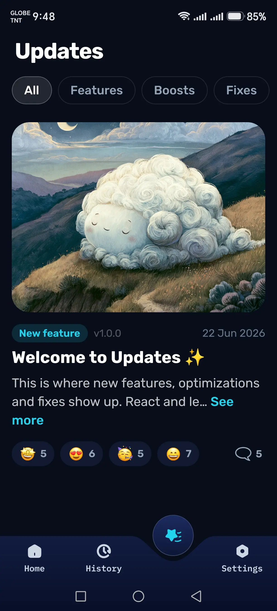
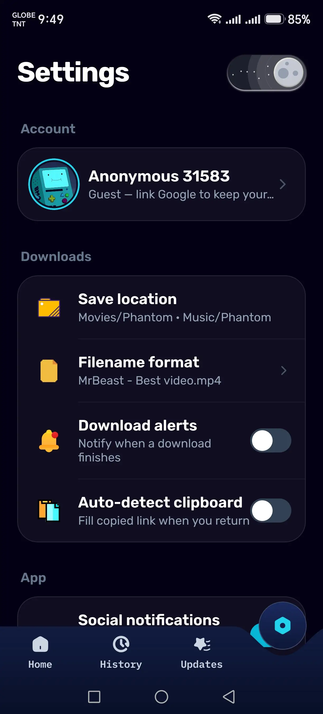
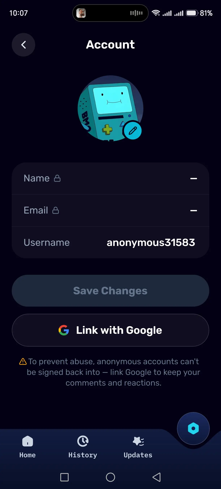

<p align="center">
  
</p>

<h1 align="center">Panther — Media Orchestration Engine</h1>

<p align="center">
  <strong>Built for musicians, creators, and power users who need professional-grade tools without the premium price tag.</strong>
</p>

<p align="center">
  <a href="https://panther-downloader.pages.dev"><strong>🌐 Visit Panther →</strong></a>
</p>

Panther downloads 4K+ video and audio, and breaks a song down into stems and chords for practice. It pushes the heavy media work onto your device instead of a slow server, and uses AI for the music analysis — so it stays free and ad-free, no bandwidth caps or paywalls.

<p align="center">
  <a href="https://dl.circleci.com/status-badge/redirect/circleci/9BjBRRbsXUjJueU2cq7uGg/YU36DWYQs3RevrR3a2o1CN/tree/main"></a>
  <a href="https://app.deepsource.com/gh/ejjays/nexstream/"></a>
</p>

<p align="center">
  <a href="https://react.dev"></a>
  <a href="https://nodejs.org"></a>
  <a href="https://pagespeed.web.dev/analysis/https-panther-downloader.pages.dev/1gip28m9kv?form_factor=desktop"></a>
  <a href="https://pagespeed.web.dev/analysis/https-panther-downloader.pages.dev/1gip28m9kv?form_factor=desktop"></a>
  <a href="LICENSE"></a>
</p>

---

## ⚡ Why Panther?

Most tools that pull down 4K video or clean audio want a subscription, or a server beefy enough to handle the muxing. That server is the real cost: free tiers get their datacenter IP bot-blocked by YouTube, and `yt-dlp` and `ffmpeg` are heavy enough to OOM them.

Panther skips the server. Resolving, downloading, and muxing all run on the device you're already using — your browser, or your phone — so there's no box to rent and nothing to OOM. That's what keeps it free, ad-free, and runnable even on a $0 Termux box.

---

## 🛠️ Core Capabilities

- **Native extractors**: ~a dozen platforms (YouTube, TikTok, Instagram, X, Threads, and more) resolve through dedicated pure-JS extractors inside the Node server — no `yt-dlp` subprocess per request. `yt-dlp` stays as the fallback for anything without one.

- **Built to feel fast**: the instant the first source returns the basics — title, artist, cover — they paint into the UI, so there's no blank spinner while the slower, more precise matching keeps racing behind it.

- **Browser-side muxing**: 4K can assemble in the browser instead of on the server — a Web Worker remuxes straight to disk via OPFS (`mediabunny`), so the UI never freezes and nothing buffers in memory.

- **Server-side muxing** (`turbo-mux.ts`): merges high-bitrate video and audio into one MP4 with `ffmpeg` stream-copy (`-c copy`) — no re-encode, so it stays light on CPU.

- **Throttle-bypass downloads**: the backend pulls `googlevideo` in parallel 8 MB ranged chunks (`chunked-fetcher.ts`) to hit full bandwidth instead of the ~playback-speed throttle.

- **Memory-only streaming**: pipes media from source to client through in-memory buffers, no disk writes — built for stateless hosts.

- **MP4 + faststart**: wraps every video download (4K VP9 included) into MP4 with `faststart`, so playback can begin before the download finishes.

- **Metadata + link refresh**: pulls official cover art, ISRC, and audio features from the music APIs; expiring CDN stream links are re-raced on retrieval to dodge 403s.

- **Live logs**: a terminal-style UI streaming real-time `yt-dlp` and `ffmpeg` output over SSE.

---

## 🧠 Resolving the Right Recording: The "Parallel Race"

Resolving a song to the _right_ recording is the hard part, so Panther races several sources in parallel and prefers verified matches over a best-guess search.

### 1. Staggered resolution + early hydration

As soon as any source returns the basics (title, artist, cover), it pushes them to the UI over Server-Sent Events (SSE) so the page fills in while resolution continues. Candidates run concurrently, ranked by trust:

- **ISRC (authoritative):** taken straight from the **Spotify Web API** when available, with **Soundcharts**, **Deezer**, and **iTunes** as fallbacks — then the track is matched by that code.
- **Aggregation:** **Odesli (Songlink)** mappings plus a **SoundCloud** search.
- **AI fallback:** if nothing strict matches, **Llama 3.3** (Groq) — falling back to **Gemini** — drafts a search query from the metadata and duration.

A verified ISRC match settles the race immediately; otherwise candidates are weighed by duration drift — a tight 25s window for low-priority candidates — so you tend to get the studio recording rather than a "live" or "cover."

### 2. Global Edge Registry (Turso)

The registry caches the _resolution_ — the "Spotify track → YouTube video" mapping with its ISRC and metadata — not the media itself, in a distributed **Turso (libSQL)** database. Only ISRC-verified matches are persisted, so bad metadata stays out, and a background worker refreshes preview links before they expire.

---

## 📱 Mobile App (Android)

<table align="center">
  <tr>
    <td align="center"></td>
    <td align="center"></td>
  </tr>
  <tr>
    <td align="center"></td>
    <td align="center"></td>
  </tr>
  <tr>
    <td align="center"></td>
    <td align="center"></td>
  </tr>
  <tr>
    <td align="center"></td>
    <td align="center"></td>
  </tr>
</table>

`mobile/` is a native React Native app (Expo, RN 0.85) that runs the **entire pipeline on-device** — resolution, download, muxing, and gallery save — with no backend in the loop. It's the answer to the web build's two hard limits: free-tier hosting gets its datacenter IP bot-blocked by YouTube, and `yt-dlp` is heavy enough to OOM it. A phone's **residential IP** sidesteps the blocks, and doing everything on-device sidesteps the server entirely.

- **Pure-JS extractors**: 13 platforms (YouTube, Spotify, Facebook, TikTok, X, Threads, and more) resolve through dedicated on-device extractors — no `yt-dlp`, no native subprocess.
- **On-device YouTube**: a hidden WebView runs `youtubei.js` with a BotGuard **PO token** and deciphers streams on the device's residential IP, then hands the URLs back to React Native.
- **Throttle-bypass downloads**: googlevideo streams are pulled in **4 MB ranged chunks, several in parallel**, to dodge its playback-rate throttle and hit full bandwidth.
- **On-device muxing**: adaptive HD video and audio are stitched with `ffmpeg-kit` (`-c copy`, no re-encode) and saved straight to the gallery.

Full architecture and build notes: **[`mobile/README.md`](mobile/README.md)**.

---

## 🎹 Remix Lab: Music Research (Beta)

The Remix Lab is a standalone research engine for **Music Information Retrieval (MIR)** — stems, chords, and key. It runs on free Kaggle/Colab GPU instances.

- **Dual-GPU split**: assigns the separation model (**Demucs** or **BS-RoFormer**) to `GPU:0` and the **BTC Transformer** (chord recognition) to `GPU:1`, to use both free T4s.

- **Stem-aware chords**: instead of guessing from the full mix, it isolates the bass frequency with `nnAudio` and cross-references the harmony stems. If the generic model hears "C Major" but the bass stem plays an "E", the Viterbi decoder resolves it to a "C/E" slash chord.

- **Single-paste bundle**: the multi-file Python module bundles itself into one copy-paste block — no `pip install` or git clone, just paste and run.

📖 **Deep dive: [`docs/remix-lab.md`](docs/remix-lab.md)** — models, dual-GPU design, the API, and how to run it.

---

## 💻 Technical Stack

### Intelligence & Data

- **Turso (libSQL)**: edge-hosted persistent registry.
- **Spotify Web API**: track metadata, ISRC, and audio features for the source link.
- **Soundcharts, Deezer, iTunes**: ISRC cross-verification when Spotify's is unavailable.
- **Odesli API**: cross-platform link mapping.
- **Llama 3.3 & Gemini**: query synthesis when strict matching fails.

### Frontend

- **React 19** — the SPA.
- **Web Workers + OPFS**: muxing runs off the main thread and streams straight to disk via the Origin Private File System, so 4K assembles in-browser without freezing the UI or buffering in memory.
- **Vite 7** — bundler + dev server.
- **Tailwind CSS 3** — styling.

### Research (Remix Lab)

- **PyTorch** — tensor ops + GPU.
- **Demucs (HTDemucs)** — source separation.
- **Madmom** — beat tracking (RNN).
- **Gradio** — the UI for the engine.

### Backend

- **Node.js + Express 5** — the API and stream orchestration.
- **Termux** — runs natively on Android.
- **yt-dlp** — fallback extraction.
- **FFmpeg 7.x/8.x** — server-side stream muxing (copy mode) and metadata injection.
- **Server-Sent Events (SSE)** — backend-to-frontend telemetry.

---

## 🚀 Deployment & Provisioning

### Native Android (Termux)

_Panther is built to run directly on your phone._

```bash
# Automated Provisioning (System Update + Dependencies + Build)
curl -sL https://raw.githubusercontent.com/ejjays/nexstream/main/scripts/setup/termux-install.sh | bash
```

### Standard Deployment

```bash
git clone https://github.com/ejjays/panther.git
cd nexstream

npm install          # root tooling (husky, prettier)
npm run install:web  # installs frontend, backend & shared in one go

# dev (two shells)
npm run api   # backend on :5000
npm run ui    # frontend
```

You'll need Node 22+, `yt-dlp`, `ffmpeg`, and Redis. `install:web` just runs `npm install` in each of `web/frontend`, `web/backend`, and `web/shared` in turn — there's no root workspace, so each keeps its own lockfile (to add a package later, install it inside that specific folder). Full setup, environment variables, Docker, and tunnel notes are in **[`docs/run-an-instance.md`](docs/run-an-instance.md)** and **[`docs/env-variables.md`](docs/env-variables.md)**.

---

## 📚 Documentation

- [Run an instance](docs/run-an-instance.md) — self-host on Termux, Docker, or a server
- [Environment variables](docs/env-variables.md) — every config option
- [Protect an instance](docs/protect-an-instance.md) — hardening a public deployment
- [API reference](docs/api.md) — endpoints and response shapes
- [Remix Lab](docs/remix-lab.md) — the music-analysis engine (stems, chords, key)
- [Android app](docs/mobile-app.md) — the standalone on-device native build
- [Contributing](CONTRIBUTING.md) · [Security policy](SECURITY.md)

---

## 🗺️ System Topology

```bash
nexstream/
├── web/backend/                # Express 5 API + stream orchestration
│   └── src/
│       ├── app.ts              # Entry point (server + SSE wiring)
│       ├── controllers/        # video / keychanger request handlers
│       ├── routes/             # video, remix, keychanger route defs
│       ├── services/           # Spotify, yt-dlp, extractors, seeder, social
│       ├── utils/              # network, media, infra, api helpers
│       └── types/              # shared TS types
├── web/frontend/               # React 19 SPA (Vite 7, Tailwind 3)
│   ├── public/                 # PWA assets, icons, static files
│   ├── functions/              # Cloudflare Pages edge functions
│   └── src/
│       ├── App.tsx · main.tsx  # SPA shell + entry
│       ├── lib/                # muxer, OPFS, SSE, orchestrator (heavy lifting)
│       ├── components/         # UI atoms + remix/terminal/modals/docs/ui
│       ├── pages/              # Tools, Guide, About, NotFound
│       ├── hooks/              # SSE, remix engine, downloads, tuner, metronome
│       ├── store/ · context/   # Zustand store + Remix context
│       └── types/              # frontend TS types
├── remix/                     # Remix Lab MIR kernel (Python, Kaggle/Colab)
│   ├── app.py · orchestrator.py
│   ├── audio_engines.py · model_manager.py
│   ├── processing.py · theory_utils.py
│   └── setup_env.py · config.py
├── mobile/                     # React Native (Expo) — standalone on-device app, no backend
│   ├── App.tsx                 # tabs (home/settings/updates) + download orchestration
│   ├── supabase/schema.sql     # Updates-tab tables + RLS
│   └── src/
│       ├── extractors/         # 13 platform pure-JS extractors + host router
│       ├── lib/                # download/, social/, net, notify, settings
│       ├── screens/            # Home, Settings, Updates
│       ├── components/         # PickerModal, sheets/, backgrounds/, icons
│       └── hooks/              # useDownload, useKeyboard, useScreenSize
├── web/shared/                 # Cross-workspace Zod schemas
├── scripts/                    # Setup, tunnels (cloudflare/ngrok/zrok), Kaggle bundler
├── docs/                       # Self-host, env, hardening, API reference
└── .github/ · .circleci/       # CI, issue/PR templates
```

---

## ⚖️ Disclaimer

Panther is for educational and research purposes. Please use it responsibly and only for content you have the legal right to process. No piracy—keep it fair.

---

### Support the Journey

I built Panther entirely on my phone because I don't have a computer yet. My goal is to keep high-quality tools like this free and ad-free for everyone. If this project helped you out, you can support my work here — it'd mean the world to me:

<p align="left">
  <a href="https://www.buymeacoffee.com/ejjays">
    
  </a>
</p>

---

## License

Panther is free software under the [GNU AGPL-3.0-or-later](LICENSE). Use it, self-host it, modify it — but run a _modified_ version as a public service and §13 asks you to offer that version's source to its users. Hosting notes: [`docs/protect-an-instance.md`](docs/protect-an-instance.md).

The standalone packages in [`packages/`](packages/) (`@panther/extractors`, `@panther/web-mux`) are licensed under **MIT** — each carries its own LICENSE file, so you can use them freely in any project, closed-source included.
