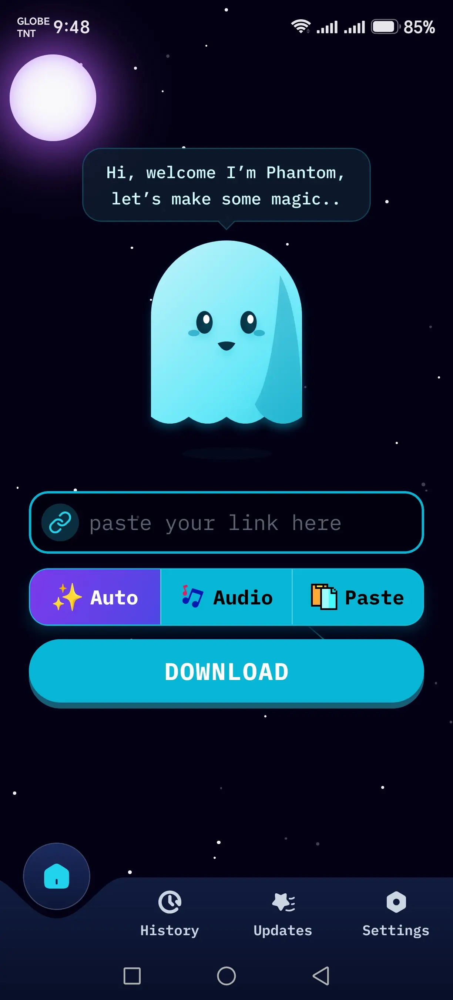
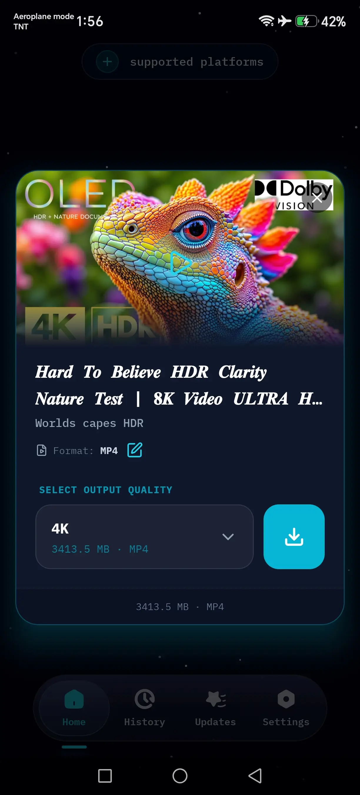
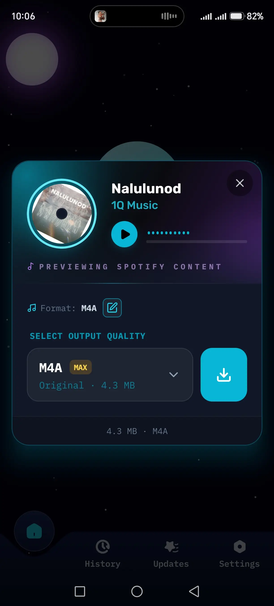
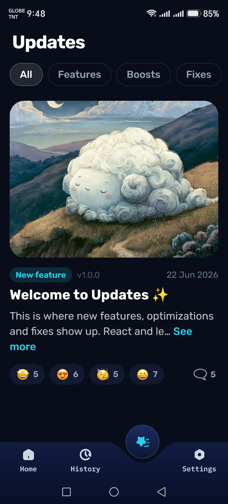
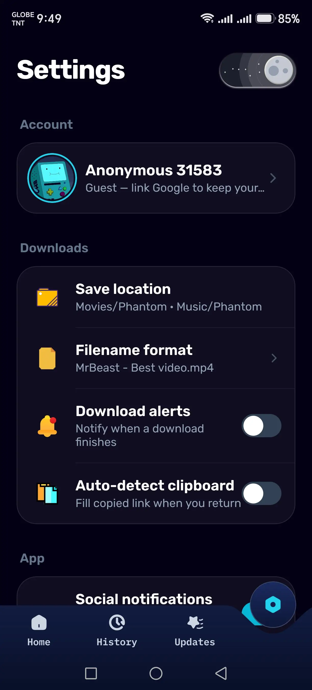
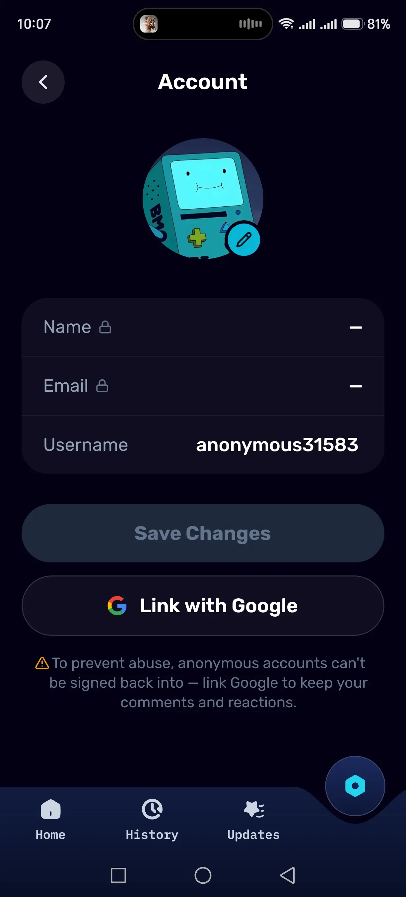

<p align="center">
  <a href="https://github.com/ejjays/phantom">
    
  </a>
</p>

<p align="center">
  <a href="https://github.com/ejjays/phantom/actions/workflows/ci.yml"></a>
  <a href="https://app.deepsource.com/gh/ejjays/phantom/"></a>
  <a href="LICENSE"></a>
</p>

---

## What this is

Phantom is hand-built pure-JS extractors that download 4K+ video and audio. It pushes heavy media work onto your device (browser or phone) instead of a server — so it stays free, ad-free, and unmetered.

**Web and Android from one repo:**

| App             | What runs where                                                                | Repo path |
| --------------- | ------------------------------------------------------------------------------ | --------- |
| **Web**         | Extraction on server (Node), browser mux via `mediabunny`, `ffmpeg` server fallback | `web/`    |
| **Android**     | Full pipeline on-device (Expo RN, Hermes, ffmpeg-kit)                          | `mobile/` |

---

## Mobile App Preview

<table align="center">
  <tr>
    <td align="center"></td>
    <td align="center"></td>
    <td align="center"></td>
  </tr>
  <tr>
    <td align="center"></td>
    <td align="center"></td>
    <td align="center"></td>
  </tr>
  <tr>
    <td align="center"></td>
    <td align="center"></td>
    <td align="center"></td>
  </tr>
</table>

---

---

## Supported platforms

| Logo | Platform | Web | Mobile | Video | Audio | Images | Notes |
| ---- | -------- | :-: | :-----: | :---: | :---: | :----: | ----- |
|  | [YouTube](https://www.youtube.com) | ✅ | ✅ | ✅ | ✅ | ➖ | playlists, shorts, 4K |
|  | [Spotify](https://open.spotify.com) | ✅ | ✅ | ✅ | ✅ | ➖ | tracks & albums resolve via youtube search |
|  | [SoundCloud](https://soundcloud.com) | ✅ | ✅ | ➖ | ✅ | ➖ | audio-only service |
|  | [Bilibili](https://www.bilibili.com) | ✅ | ✅ | ✅ | ✅ | ➖ | some videos need a cookie |
| <picture><source media="(prefers-color-scheme: dark)" srcset="web/site/public/logos/tiktok.svg" /></picture> | [TikTok](https://www.tiktok.com) | ✅ | ✅ | ✅ | ✅ | ✅ | videos + photo carousels |
|  | [Instagram](https://www.instagram.com) | ✅ | ✅ | ✅ | ✅ | ✅ | reels, posts, multi-image picker |
|  | [Facebook](https://www.facebook.com) | ✅ | ✅ | ✅ | ✅ | ✅ | public posts only |
| <picture><source media="(prefers-color-scheme: dark)" srcset="web/site/public/logos/threads.svg" /></picture> | [Threads](https://www.threads.com) | ✅ | ✅ | ✅ | ✅ | ✅ |  |
| <picture><source media="(prefers-color-scheme: dark)" srcset="web/site/public/logos/x.svg" /></picture> | [X / Twitter](https://x.com) | ✅ | ✅ | ✅ | ✅ | ➖ | videos & gifs only |
|  | [Bluesky](https://bsky.app) | ✅ | ✅ | ✅ | ❌ | ➖ | hls only, no audio |
|  | [Vimeo](https://vimeo.com) | ✅ | ✅ | ✅ | ❌ | ➖ | hls only, no audio |
|  | [Dailymotion](https://www.dailymotion.com) | ✅ | ✅ | ✅ | ❌ | ➖ | hls only, no audio |
|  | [Reddit](https://www.reddit.com) | ✅ | ✅ | ✅ | ✅ | ➖ |  |
|  | [Pinterest](https://www.pinterest.com) | ✅ | ✅ | ✅ | ✅ | ✅ | video pins + photos |
|  | [Twitch](https://www.twitch.tv) | ✅ | ✅ | ✅ | ❌ | ➖ | clips, hls only |
|  | [Snapchat](https://www.snapchat.com) | ✅ | ✅ | ✅ | ✅ | ➖ | spotlight videos + t.snapchat.com shorts |
|  | [Watchluna](https://lunagate.org) | ❌ | ✅ | ✅ | ❌ | ➖ | movies & shows, 1080p hls |

---

## Quick start (web)

> Web UI wip — mobile is the focus for now.

```bash
# Prerequisites: Node 22+, ffmpeg, Redis (yt-dlp optional — deep-scan fallback only)
git clone https://github.com/ejjays/phantom.git
cd phantom

npm install              # root tooling (husky, prettier)
npm run install:web      # installs app, api, shared

# Create env files (see docs/env-variables.md)
cp web/api/.env.example web/api/.env
cp web/app/.env.example web/app/.env

# Dev (two terminals)
npm run api   # api on :5000
npm run ui    # app dev server
```

**Production-style:**

```bash
npm run build:api
npm run build:ui
cd web/api && npm start
```

**Docker (api only):**

```bash
docker build -f web/api/Dockerfile -t phantom .
docker run -p 8000:8000 --env-file web/api/.env phantom
```

---

## Quick start (Android)

```bash
cd mobile
npm install
npm start       # Expo dev client
# or
eas build --profile development  # dev client APK
```

Prebuilt APKs: see [the mobile README](mobile/README.md) (Android only — iOS untested/unsupported).

---

## Architecture overview

```
phantom/
├── web/
│   ├── app/            # React 19 + Vite + Tailwind + Styled Components
│   ├── api/            # Express 5 + pure-JS extractors + ffmpeg + Redis + Turso
│   ├── site/           # Astro landing page (merges app under /app/ at deploy)
│   └── shared/         # @phantom/shared (Zod schemas)
├── mobile/             # Expo SDK 57, RN 0.86, Hermes, New Arch
│   ├── src/extractors/ # 16 pure-JS platform extractors
│   ├── src/lib/        # download pipeline, social, net, notify
│   └── src/components/ # UI, sheets, backgrounds, webviews
├── packages/
│   ├── extractors/     # @phantom/extractors (shared fb/threads/social)
│   └── web-mux/        # @phantom/web-mux (shared media mux core)
├── scripts/            # termux install, tunnels
└── docs/               # self-host, env, hardening, API, mobile
```

**Key architectural decisions** live in [`docs/run-an-instance.md`](docs/run-an-instance.md#design-notes).

---

## Documentation

| Doc                                                          | What it covers                                                         |
| ------------------------------------------------------------ | ---------------------------------------------------------------------- |
| [`docs/run-an-instance.md`](docs/run-an-instance.md)         | Prerequisites, Termux, Docker, tunnels, dev/prod commands              |
| [`docs/env-variables.md`](docs/env-variables.md)             | Every env var, defaults, where to get API keys                         |
| [`docs/protect-an-instance.md`](docs/protect-an-instance.md) | Hardening a public deployment (API key, URL signing, rate limits, TLS) |
| [`docs/api.md`](docs/api.md)                                 | Endpoint contracts, request/response shapes, SSE events                |
| [`docs/mobile-app.md`](docs/mobile-app.md)                   | Android app architecture, extractors, download pipeline, EAS build     |
| [`docs/phone-worker-setup.md`](docs/phone-worker-setup.md)   | Legacy: using a spare phone as yt-dlp/media relay for the web API      |
| [`docs/license.md`](docs/license.md)                           | Which license covers what (apps vs packages)                           |

---

## License

See [`LICENSE`](LICENSE) and [`docs/license.md`](docs/license.md).

---

## Disclaimer

For personal use only. Download only content you have rights to.
